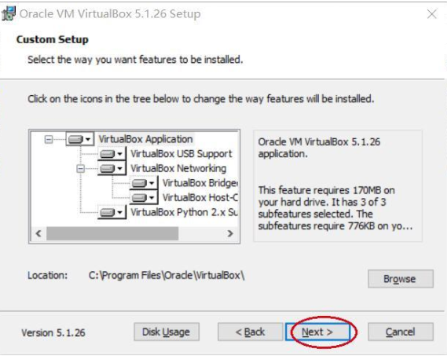
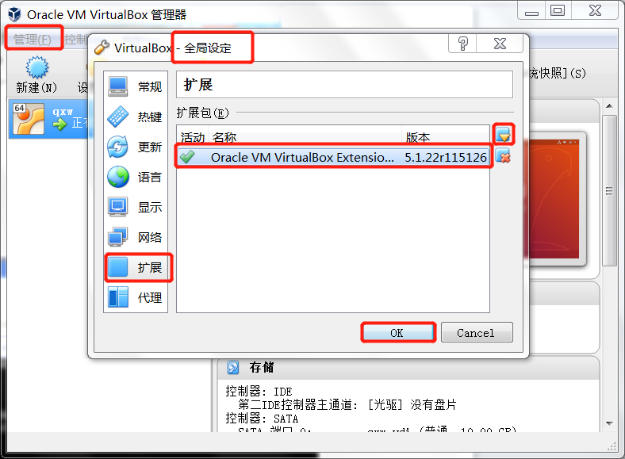
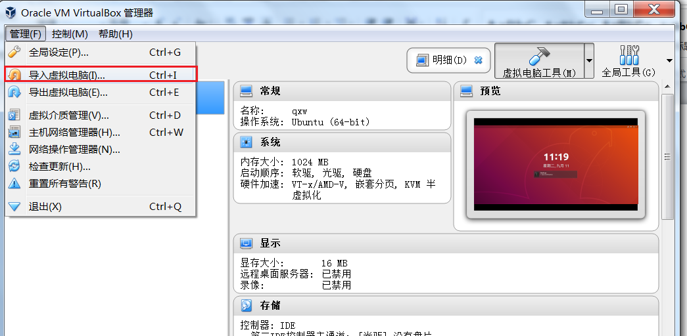

## 开发环境快速搭建

Project 0 的任务主要是为后面的实验准备环境和工具。
我们会涉及到作为开发环境的Linux操作系统、交叉编译器 `riscv-gcc`、虚拟机软件 `QEMU`，以及基于 FPGA 的 RISC-V 开发板。
我们的开发语言以 `C` 语言为主，但绕不开一些基本的 RISC-V 指令集汇编语言，调试工具除了使用 `printf` 之类用于打印的函数外，一定要熟悉 `gdb` 的断点与寄存器查看的功能，整个工程要通过 `git` 工具进行管理等等。
如果这些工具已经把你弄得有点晕头转向，那么一定要花点时间耐心地看看 Project 0 的相关知识，因为这些工具是操作系统开发的标准配置，特别是调试工具等。
如果不能用好工具，开发操作系统可能会寸步难行。

看到这么多要学的工具用法和准备知识，也不要害怕，边学边用是我们的法宝。让我们开始吧。

为了让大家快速完成开发环境的搭建，我们已经将开发所需的环境集成到我们所给的 VirtualBox 虚拟机镜像中，
同学们只需要安装完成 VirtualBox，导入我们所给的镜像，并简单配置一下即可。
当然，我们也在附录中给出了手动配置环境的具体流程，感兴趣的同学可以了解一下。

关于环境搭建所需的工具，我们已经拷贝到了发给大家的SD卡中。
此外，我们也将工具上传到了百度云中通过网盘分享的文件：OS研讨课2025，链接:<https://pan.baidu.com/s/1uJBhWIF3f_Io1YKPmlBK0g> 提取码: ucas 。

### Windows实验环境搭建

这一节主要讲解Windows下环境的搭建，搭建实验环境所需文件及描述见表 。

<!-- Table: Windows实验环境所需文件{tab:windows-evn-files -->

首先，需要安装VirtualBox虚拟机。右键打开菜单，选择**以管理员身份运行**。按照安装向导的提示一步步完成安装即可。完成后打开虚拟机软件（如图  所示）。

完成VirtualBox的安装后，需要再进一步安装VirtualBox的扩展包。VirtualBox扩展包主要用于增强VirtualBox的USB 2.0、USB 3.0、摄像头等设备的支持，可以提高部分设备的性能。安装方法为：运行VirtualBox->管理->全局设定->扩展->选择扩展包目录->安装->重启。过程如图所示。





!!! note
    
VirtualBox 最早由 Sun Microsystems 公司开发并以 GPL 协议开源。在 Oracle 收购 Sun 后
，VirtualBox 主体部分仍以 GPL 协议开源的，但一些增强功能以采用 PUEL 协议的 Extention Pack 的方式提供。
该协议规定，可以出于个人和教育目的免费使用 Extention Pack。商业用途需付费购买许可。

之后，请按照  小节的说明，将虚拟机导入，
导入后就可以使用我们预先制作好的 Ubuntu 虚拟机中的环境，开始操作系统实验了。

 
### 导入虚拟机{subsec:import_vbox
}
VirtualBox 导入虚拟机的方式在不同平台上都是相同的，这里以 Windows 上导入虚拟机镜像为例。
过程如图  所示。RISC-V 版本实验环境采用 Ubuntu Server 20.04，文件名为 `UCAS\_OS\_2024.ova`。
请注意选择正确的虚拟机镜像进行导入。

我们预先配置好的镜像，用户名是`stu`,密码是`123456`。


 

### Linux实验环境搭建{subsec:linux_env
}
建议在Linux下也安装VirtualBox，然后按照  小节的内容直接导入我们准备好的虚拟机。我们准备的虚拟机上环境都已经配齐了。

当然，如果你不喜欢虚拟机，我们也欢迎大家直接在Linux系统上配置整套环境。接下来，我们会介绍一下如何在Linux下自行构建交叉编译工具链，并配置相关开发环境。这也是我们为虚拟机镜像配置相关环境的过程。

首先，安装minicom。一般直接使用包管理器安装即可。

```bash
在Ubuntu/Debian/Deepin等系统下
$ sudo apt-get install minicom
在Fedora/CentOS等系统下
$ sudo yum install minicom

```

接着，安装构建交叉编译工具链所需依赖。

```bash
在Ubuntu/Debian/Deepin等系统下
$ sudo apt-get install autoconf automake autotools-dev curl libmpc-dev libmpfr-dev
$ sudo apt-get install libgmp-dev gawk build-essential bison flex texinfo gperf 
$ sudo apt-get install libtool patchutils bc zlib1g-dev libexpat-dev
在Fedora/CentOS等系统下
$ sudo yum install autoconf automake libmpc-devel mpfr-devel gmp-devel gawk  bison 
$ sudo yum install flex texinfo patchutils gcc gcc-c++ zlib-devel expat-devel

```

最后，解压我们提供的riscv-gnu-toolchain.zip,构建交叉编译工具链。

```bash
在解压出来riscv-gnu-toolchain同级目录下建立一个用于构建的目录
$ mkdir rv64-gnu-tools
进入新建立的目录
$ cd rv64-gnu-tools
构建并安装到/opt/riscv64-linux
$ ./configure --prefix=/opt/riscv64-linux
$ sudo make linux -j4
注意，-j4代表4线程编译，你的机器几个核就设置使用几个线程，请自行调节该参数。

```

为了方便，可以将为工具链配置环境变量。

```bash
打开文件.bashrc
$ vi ~/.bashrc
按i进入编辑模式，在文件末尾添加语句：export PATH=/opt/riscv64-linux/bin:$PATH
按ESC退出编辑模式，按:wq保存退出vi。

导入环境变量
$ source ~/.bashrc

```

测试一下，应该就可以找到交叉编译工具链了。

```bash
$ riscv64-unknown-linux-gnu-gcc -v
Using built-in specs.
COLLECT_GCC=riscv64-unknown-linux-gnu-gcc
COLLECT_LTO_WRAPPER=/opt/riscv64-linux/libexec/gcc/riscv64-unknown-linux-gnu/
8.3.0/lto-wrapper
Target: riscv64-unknown-linux-gnu
Configured with: /home/wangluming/os_course/riscv-gnu-toolchain/riscv-gcc/configure --target=riscv64-unknown-linux-gnu --prefix=/opt/riscv64-linux --with-sysroot=/opt/riscv64-linux/sysroot --with-system-zlib --enable-shared --enable-tls --enable-languages=c,c++,fortran --disable-libmudflap --disable-libssp --disable-libquadmath --disable-nls --disable-bootstrap --src=/home/wangluming/os_course/riscv-gnu-toolchain/riscv-gcc --enable-checking=yes --disable-multilib --with-abi=lp64d --with-arch=rv64imafdc --with-tune=rocket 'CFLAGS_FOR_TARGET=-O2-mcmodel=medlow' 'CXXFLAGS_FOR_TARGET=-O2  -mcmodel=medlow'
Thread model: posix
gcc version 8.3.0 (GCC)

```

RISC-V的交叉编译工具链的编译在有些时候会依赖某些库的特定版本。如果构建过程中发生编译错误，可能是因为库版本不合适，具体哪个库有问题不好定位。笔者曾在CentOS 7和Ubuntu 20.04上测试，这两个发行版自带的库版本是可以正常编译的。webIDE上的环境是Ubuntu的，所以可以正常安装。

除了安装交叉编译工具链之外，为了方便调试，还推荐大家使用QEMU模拟器，安装的方法类似，使用我们提供的安装包编译QEMU和U-boot即可。需要注意的是，我们在start-code中给出了Makefile，里面指定了默认的QEMU路径，需要大家在安装的时候也构造出相同的路径，或者根据自己的喜好，把Makefile里面的默认路径改掉。


## 开发板及工具介绍

实验采用XILINX PYNQ Z2开发板，开发板的处理单元由ARM核部分和FPGA部分构成。在开发板上电时，首先由ARM核启动板卡初始化相关程序，其根据板卡上标有SW1的开关的状态，将RISC-V处理器核烧入FPGA。之后，RISC-V核加载我们编写的程序。

实验中使用的RISC-V核为升级后的双核Nutshell。NutShell为国科大第一届“一生一芯”计划的产出，已在Github等网站上开源，我们升级并维护的版本为https://github.com/DASICS-ICT/NutShell-DASICS{NutShell-DASICS}，感兴趣的同学可以自己搜索了解。在PYNQ板卡上，时钟主频为50MHz。后续的实验中可以通过不同的命令启动单/双核 Nutshell。 由于资源限制，我们提供的RISC-V核心均没有浮点模块。 

### 开发板的启动

我们使用的开发板如图所示。请按照图示的顺序配置并使用开发板。

- **将开发板设置为SD卡启动**

图示中1处的跳线设置的是开发板的启动方式。PYNQ-Z2支持从SD卡、QSPI和JTAG启动。我们将跳线插到最左侧，选择用SD卡启动。请保证跳线跳在了最左侧的两个针脚上面。

- **设置电源选项** 

图示中的2处的跳线设置的是开发板的供电方式。PYNQ支持外部电源供电和Micro-USB接口供电。我们把跳线跳在USB这个选项上（靠上侧的两个针脚），用Micro USB接口直接供电。

- **插入SD卡** 

插入根据节所述制作好的SD卡。注意插入方向，不要插反。

- **插入Micro-USB数据线** 

Micro-USB线一端连接图示4位置，一端连接笔记本的USB口。PYNQ-Z2开发板和电脑通过Micro-USB线连接。连接好后，Micro-USB线同时承担供电和通信的功能。

- **打开电源开关** 

打开图示5位置的电源开关，开发板上红色指示灯亮起，之后绿色的Done信号灯亮起。之后代表NutShell的LED灯LD0亮起1秒后熄灭，随后Done信号灯重新亮起，表明开发板已开始工作。

- **RESET键**

图示6位置为RESET按键，板子上标记SRST字样。按下该按键会让开发板重置。如果需要开发板从加电开始重新再执行一遍，可以按该按键。


### minicom的配置

在主机端，我们使用minicom和开发板通信。启动minicom的方法为：

```bash
$ sudo minicom -s

```

需要把Serial port setup中的Serial Device设为/dev/ttyUSB1。同时，确保Bps/Par/Bits项的值为115200。过程如图所示。**注意：与图中不同，Serial Device需要设置为/dev/ttyUSB1**。


将SD卡插入开发板（确保第一个分区中包含了BOOT.BIN等文件），在连接并启动开发板并打开minicom后，按下重置键（SRST）。
如果设置正确，可以看到终端输出RISC-V启动环境的信息。

!!! note
    
 如果直接打开了minicom，没有加-s选项，也可以在minicom界面中用键盘进行操作，操作方法是先按Ctrl-A，再按相应按键。例如：Ctrl-A X退出minicom，Ctrl-A Z显示帮助。
