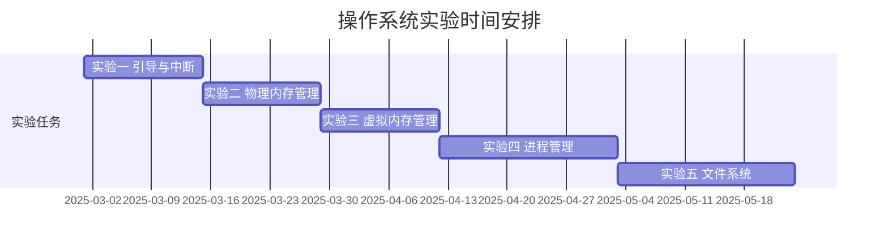

# 任务概览

本页面提供所有实验任务的概览和时间安排。

## 实验时间表

## 实验详情

### 实验一：引导与中断

**学习目标：**

- 理解计算机启动过程
- 掌握中断处理机制
- 实现基本的异常处理

**主要任务：**

1. 编写 bootloader，完成系统引导
2. 设置中断描述符表（IDT）
3. 实现时钟中断处理
4. 实现键盘中断处理

[查看详情 →](lab1.md){ .md-button }

---

### 实验二：物理内存管理

**学习目标：**

- 理解物理内存管理的基本原理
- 掌握内存分配算法
- 实现内存管理子系统

**主要任务：**

1. 检测可用物理内存
2. 实现物理页面分配器
3. 实现 buddy system 算法
4. 编写内存管理测试用例

[查看详情 →](lab2.md){ .md-button }

---

### 实验三：虚拟内存管理

**学习目标：**

- 理解虚拟内存的概念和作用
- 掌握分页机制
- 实现页表管理

**主要任务：**

1. 建立页表映射
2. 实现虚拟地址转换
3. 处理缺页异常
4. 实现页面置换算法

[查看详情 →](lab3.md){ .md-button }

---

### 实验四：进程管理

**学习目标：**

- 理解进程的概念和生命周期
- 掌握进程调度算法
- 实现进程同步机制

**主要任务：**

1. 实现进程控制块（PCB）
2. 实现进程创建和销毁
3. 实现进程调度器
4. 实现信号量和互斥锁

[查看详情 →](lab4.md){ .md-button }

---

### 实验五：文件系统

**学习目标：**

- 理解文件系统的组织结构
- 掌握文件管理机制
- 实现简单文件系统

**主要任务：**

1. 设计文件系统布局
2. 实现 inode 管理
3. 实现文件读写操作
4. 实现目录管理

[查看详情 →](lab5.md){ .md-button }

---

## 实验评分标准

每个实验的评分由以下部分组成：

| 评分项 | 占比 | 说明 |
|-------|------|------|
| 代码实现 | 50% | 功能完整性、代码质量 |
| 实验报告 | 30% | 理解深度、表达清晰度 |
| 测试用例 | 10% | 测试覆盖率、测试质量 |
| 创新性 | 10% | 额外功能、优化改进 |

!!! note "提示"
    实验成绩将在提交后 2 周内公布，请关注课程通知。

## 常见问题

??? question "如何获取实验代码框架？"
    实验代码框架将在每个实验开始时发布在课程代码仓库中，请使用 git clone 获取。

??? question "实验可以延期提交吗？"
    原则上不接受延期提交。特殊情况请提前联系助教说明情况。

??? question "实验遇到问题怎么办？"
    建议先查阅文档和参考资料，若仍无法解决可在讨论组提问或联系助教。

??? question "可以使用第三方库吗？"
    除非实验明确说明，否则应仅使用标准库和课程提供的代码框架。
