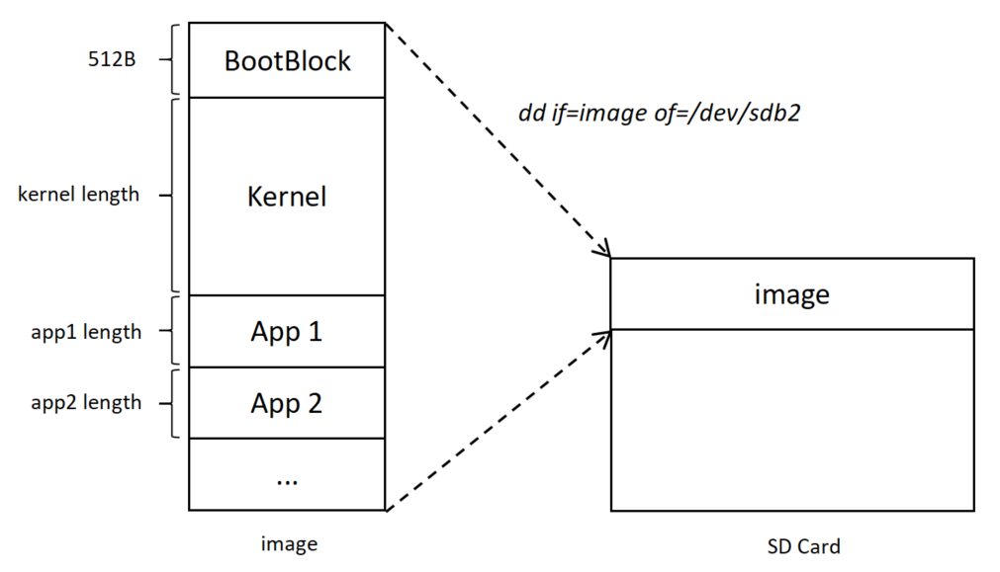
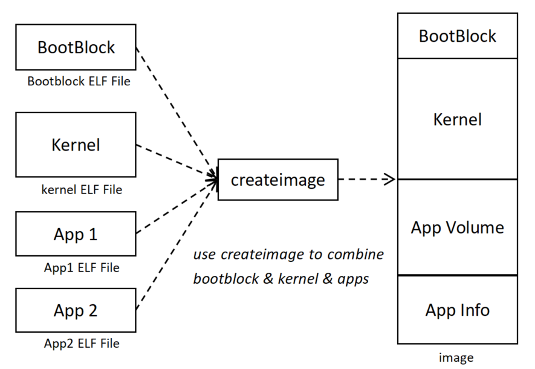

# 引导、镜像文件和ELF文件

## 引言

我们的课程是要同学们自己从头写一个操作系统，一个包含了操作系统主要功能的小小的操作系统，“麻雀虽小，五脏俱全”。

开发操作系统可以说是非常考验一个人计算机综合素养的工作，除了要对操作系统、组成原理、数据结构的相关知识有一定的了解，还需要在编程方面掌握C语言、汇编语言，在工程方面掌握Makefile、ld等编译工具链的使用，了解相关的硬件知识；在后期，还会涉及到网络、存储的内容，可以说是需要“上知天文，下知地理”。也正因为这样的特点，我们在正式课开始之前加入了预备课的介绍，这些内容都是后续课程中一定会用到的，请大家一定要掌握里面涉及到的知识和工具，至少确保完成预备课的作业。

操作系统的复杂性也正体现了其把握计算机系统全局的中枢软件的本质。希望同学们学完这门课之后，能够体会这种对各种系统资源的管理和调度的思想，不仅能说清楚自己的小操作系统中的每一行代码的功能，也能讲出设计上的思考过程。

在实验一中，我们将从操作系统的引导（boot）开始，掌握和实现操作系统的启动过程，并在实现的过程中，熟悉Linux下相关工具的使用、C语言和汇编语言的编写、镜像文件的制作等内容。俗话说得好，“万事开头难”，希望大家能够认真完成实验！接下来，我们将从理论到实验，迈出开发属于我们自己的操作系统的第一步。

## 实验要点解读

Project 1的要点是：

    
**1. 掌握操作系统启动的完整过程，体会软件和硬件、内核和应用的分工与约定** 
    
**2. 掌握ELF文件的结构和功能，以及ELF文件的装载** 
    
**3. 设计加载映像的索引结构** 

简单点说，就是要学会在裸金属机器(bare-metal)上面跑程序。远古时期的程序其实都是直接在裸金属机器上跑的，没有什么操作系统。后来，大家觉得有些功能每次都自己写太麻烦了，就把他们抽取成了固定的模块，用什么功能就调用什么模块就好了。操作系统可以被认为是跑在裸金属机器上面的一段程序，负责为其他的用户程序提供一些通用的服务。所以，实验一的最重要的两个需要搞懂的知识点：

    
**1. 程序是从哪里，如何开始运行的？** 
    
**2. 程序是如何通过调用终端服务实现简单的输入输出功能？** 

## 操作系统的引导

### 什么是引导

我们需要实现的操作系统实际上是一个特殊的程序，用来控制其他用户程序在计算机上的执行。我们在组成原理课上学过，程序是随着`PC`寄存器的指示逐步执行下去的，既然操作系统也是一个程序，那么我们就需要让它从运行起来，这就是引导程序（Boot Loader）需要做的事情。引导程序主要的任务就是将操作系统代码从外部存储设备（本实验中为SD卡），搬运并展开到内存中，然后将`PC`跳转至此处执行，整个过程就称为“引导” (Booting)。

所以，这一节讲的是主要是上面提到的第一个问题：**程序是从哪里，如何开始运行的**。 最简单的一个答案是：CPU上电以后，`PC`（Program Counter）寄存器会被设置到一个固定的地址上。CPU会从这个地址读取指令并开始执行。

当然喽，细心的你估计很快就想到了一个问题：我们怎么才能把程序放在这个地址上？答案是把这个地址映射到ROM上。ROM和内存（RAM）很像，只不过是只读的，内容一旦烧好了就没法改（但是现在的技术也可以修改一些ROM，这是组成原理课程所学的内容）。所以，ROM里面的程序一般是厂家提前烧好的。CPU一启动，先执行ROM里面的程序。在我们常用的PC上面这个东西叫做BIOS（Basic Input-Output System）,而其他系统上有时又称为固件（Firmware）。

通常ROM上的程序会做必要的初始化工作，然后读取磁盘（或者其他指定设备）头512字节的数据到内存的指定地址，最后跳转到该地址开始执行。这512字节的数据就是操作系统的bootloader，它负责把操作系统的主体部分载入到内存，然后将控制权交由操作系统。

### RISC V开发板上的引导过程

上面介绍的这一过程是常识性的boot过程。针对我们手中的开发板，我们需要更详细的了解其中的启动过程。关于我们使用的PYNQ板卡的信息在Project 0中已经有所介绍；在没有拿到板卡之前，大家在QEMU上完成Project，其模拟了板卡上的启动流程。QEMU的相关信息已经在预备课上跟大家介绍过。


图中，蓝色的框表示的是PYNQ上的ARM硬核上完成的动作，棕色的框表示的是RISC-V核加电后进行的动作。而黄色的部分是我们的实验需要完成的。前面的流程是硬件或者BIOS自动完成的动作。从`bootblock.S`的代码被自动加载后的部分是我们需要自己完成的部分。可以认为，从这里开始，我们自己编写的操作系统开始启动。

对于我们的实验来说，引导分为三个过程：

- **BIOS阶段:** 在CPU上电后，`PC`会自动跳转到一个位置开始执行。这个位置上的代码主要的任务就是将存储设备上的第一个扇区（一个扇区的大小为512B）的内容拷贝到一个固定的位置（在我们的开发板中，这个位置是`0x50200000`），这512B的数据就是我们的Boot Loader。拷贝完成后，`PC`跳转到Boot Loader代码的开头部分，至此，控制权被移交给Boot Loader。

- **Boot Loader阶段:** 由于Boot Loader的代码只有512字节，因此只完成1个重要的工作：将操作系统代码搬运并展开到内存。Boot Loader通过BIOS（对应于我们这里的BBL）提供的调用读取SD卡上的操作系统内核，并放置到内存的指定位置。读盘结束后，Boot Loader将跳转到操作系统的入口代码开始执行，至此，操作系统的引导过程结束，真正的操作系统已经运行起来啦！

- **OS阶段:** 这个阶段运行的就是我们真正的操作系统代码了，在这个阶段的初期，我们会进行各种初始化，这部分也将在以后的实验中详细讲解。

在本实验中，我们将通过循序渐进的几个任务，逐步实现一个操作系统的Boot Loader。

### 跳转表

对于操作系统来说，一个非常重要的特性就是提供给应用程序一套标准的服务，又称系统调用 (syscall)，我们后面的实验会涉及到这一点。同样的，在操作系统刚加载时，BIOS也会给操作系统引导代码提供一套服务，如最基本的显示和磁盘读写操作。一般来说，BIOS的服务只提供给操作系统，应用程序不可见，因此BIOS服务的接口设计是多种多样的。在我们的实验课中，我们采用了相对简单的跳转表的接口。

跳转表，顾名思义，是一个用来跳转的表。我们需要实现的跳转表，是一个由内核进行初始化、记录硬件提供给操作系统的ABI（例如串口输入输出、SD卡读写等操作）的入口地址的表格。（ABI的介绍见P0）在标准的RISC-V架构中，这些ABI是通过SBI (Supervisor Binary Interface) 调用来实现的，涉及到保护态的切换，而其他架构中没有SBI调用。还没学过《操作系统》的同学们现在可能暂时不知道特权级的概念，不太理解Supervisor的意思，这会在之后的理论课中讲解。
我们把这些涉及不同架构的硬件ABI调用放入跳转表进行封装，操作系统使用跳转表的 API (Application Programming Interface, 应用程序编程接口) 来执行原本的功能。这样，进行操作系统移植时，我们只需要修改跳转表表项内容，而不需要直接面对各种不同的BIOS功能调用接口。
API是一种计算接口，它定义多个软件中介之间的交互，以及可以进行的调用等操作的种类。这里我们指的是跳转表这个软件提供给调用者的编程接口。

实现跳转表的另一个目的在于，在我们进行Project 2的实验并实现系统调用之前，用户程序实际上都是以内核进程的方式运行，需要用到内核提供的API。而在本学期的实验课中，内核代码与用户/测试程序代码分开编译，用户程序需要内核填写的跳转表来逐步过渡到系统调用方式，并不能直接在编译过程中找到内核中的函数。

跳转表的初始化代码与相应的API已提供给大家，同学们只需了解其过程即可。

### 任务1：第一个引导块的制作 {#p1-task1}

#### 实验要求

了解掌握操作系统引导块的加载过程，编写Boot Block，调用BIOS中的输入输出函数，在终端成功输出`"It's [who]'s bootloader..."`。将 `who` 改为作者自己的名字。
需要特别说明的是，在任务1和任务2中，大家还暂时没有实现自己的镜像制作工具的`createimage`，因此需要使用我们提供给大家的可执行文件。当然，为了让大家能够自己完成`createimage`的设计，这份可执行文件只能满足任务1和任务2的需求，在任务3中会直接报错退出。


#### 文件说明

实验一的初始代码只包含一些基本的目录和文件。具体的说明见下表。以后，我们会在实验一的基础上逐步增加代码和功能。请同学们一定要学会Git使用，做好代码管理。需要大家补全的部分，我们基本上都在代码框架中有所注释。

|编号  | 文件/文件夹  | 说明              |
|----|--------------|------------------|
|1 |    `arch/riscv`文件夹 | RISC-V架构相关内容，主要为汇编代码、相关宏定义 <br/>`bios/common.c`：BIOS所提供的API函数，包括：输入输出、读取SD卡，不需要修改 <br/>`boot/bootblock.S`：引导程序，接下来将在任务1中填写打印代码，在任务2中添加移动内核代码,在任务3中读取用户程序信息 <br/>`crt0/crt0.S`：测试程序入口代码，负责准备测试程序C语言执行环境，需要在任务3中补全<br/>`include`：头文件，包含一些宏定义，不需要修改 <br/>`kernel/head.S`：内核入口代码，负责准备内核C语言执行环境，需要在任务2中补全 |
|2 |    `include`文件夹 |    内核使用的头文件，其中`os/task.h`需要在任务3中补全 | \hline
|3 |    `init`文件夹 | 初始化相关 <br/>`main.c`：内核的入口，操作系统的起点，在任务3、任务5中需要补充装载用户程序的逻辑 |
|4 |    `kernel`文件夹 |内核相关文件 <br/>`loader/loader.c`：装载器的实现，需要在任务3中补全以加载用户程序 |
|5 |    `libs`文件夹 |为内核提供的库函数 <br/>`string.c`：字符串操作函数库 |
|6 | `tiny_libc`文件夹 |为用户程序提供的超小型libc库 <br/>`include`：头文件，本次实验为用户程序提供了跳转表头文件`bios.h`，不需要修改 |
|7 | `tools`文件夹 |工具 <br/>`createimage.c`：引导块工具代码，任务3中需要实现 | 
|8 |    `Makefile`      | Makefile文件，不需要修改 | \hline
|9 |    `riscv.lds`      | 链接器脚本文件，不需要修改 | \hline
|10 |    `createimage`     | 将bootblock和kernel制作成镜像文件的工具，无法在任务3-5中使用，需要同学们用自己写好的`createimage`来替代 | \hline


#### 实验步骤

注：带星号标记的步骤需要等到PYNQ板卡发给大家之后，才能连接SD卡与PYNQ板卡上板运行。

	
-  填写`bootblock.S`代码，要求添加的内容为打印字符串 `"It's [who]'s bootloader..."`。

	
-  运行`make dirs`命令创建`build`目录。

	
-  运行`make elf`命令进行交叉编译，生成二进制文件。

	
-  将提供的可执行文件`createimage`，复制一份到`build`目录中，连续执行三个命令以生成镜像文件`image`：

```bash
    cd build
    ../createimage --extended bootblock main
    cd ..
```
	
-  执行`make run`命令，在QEMU上能看到屏幕输出字符串：
	
	`"It's [who]'s bootloader..."`


-  *使用`make floppy`命令将`image`文件写入到SD卡。

	
-  *将SD卡插入到板子上，使用`make minicom`命令监视串口输出，然后restart开发板。

	
-  *板子加电后，系统启动，当屏幕可以打印出字符串 `"It's [who]'s bootloader..."`说明实验完成。

!!! Warning 提醒
    注意启动 QEMU 模拟器之后，还需要在命令行中输入 loadboot 命令才能进一步启动操作系统。

#### 注意事项

    
注意`createimage`的执行命令里面，`extended`前面有两个减号，不要遗漏。在文件前添加一个或两个减号，是一种为执行的命令（程序）添加参数选项的一种常用表示方法。
    
    
`createimage`执行的时候可能会提示没有运行权限：`Permission denied`。这是因为把程序从外面拷贝进虚拟机的时候没有自动设置可执行权限，需要执行下面的命令让它可以执行：`sudo chmod +x createimage`，其中`sudo`是使后续的命令执行环境临时获取管理员权限的命令，`chmod`是更改文件夹、文件权限的命令，`+x`的意思是添加可执行 (execute) 权限。后续实验遇到类似的报错时都可以使用手动赋予执行权限的方式解决。

#### 要点讲解

任务1中需要补全的位置都用与 `"//TODO:[p1-task1]`" 类似的样式做了标记，大家可以搜索该标记，从而能够更快定位到需要修改/补全的地方。对于后续的任务，我们也定义了类似的样式。

同时，实验中的BIOS（即BBL）提供了若干与底层硬件相关的API，例如输入输出函数、读取SD卡函数。这些函数的具体实现较为复杂，且与操作系统本身无关，因此同学们只需要知道如何调用BIOS API即可。为了简化同学们的使用，BIOS内的各函数使用统一的入口地址`0x50150000`，即`bios_func_entry`。同学们在汇编语言层面调用的时候，需要把函数编号放在a7寄存器中，函数参数依次放入`a0`、`a1` ...寄存器中，然后`jal bios_func_entry`即可，可供调用的接口编号定义在`biosdef.h`中。这里给大家一个小小的提示：各位同学可以参考`common.c`里面的各个BIOS C语言函数原型，看看它们是如何填写参数、调用`call_bios`函数的。如有对汇编代码的更多了解需求，请查询Project 0的RISC-V伪指令表。

现将本次实验中用到的函数原型说明如下：

  
- `void bios_putstr(char *str)` 在终端打印字符串 `str`。

  
- `uintptr_t bios_sd_read(unsigned mem_address, unsigned num_of_blocks, unsigned block_id)`从SD卡的第`block_id`个扇区开始（扇区从`0`开始编号）读取`num_of_blocks`个扇区，放入内存`mem_address`处。
	  
  
- `uintptr_t bios_sd_write(unsigned mem_address, unsigned num_of_blocks, unsigned block_id)`将内存`mem_address`处的内容，写入到SD卡的第`block_id`个扇区开始（扇区从`0`开始编号）的`num_of_blocks`个扇区中。
  
- `void bios_putchar(int ch)` 在终端打印字符`ch`。

  
- `int bios_getchar()` 读取终端输入字符`ch`，如果未读取到任何字符则返回`-1`。

!!! note
    扩展名为`.S`和`.s`的汇编文件是不一样的。`.S`的汇编文件会被预处理，可以像C语言一样加预处理指令，比如`include`一类的。但`.s`文件不会进行预处理。

#### 实验总结

该实验仅仅是在引导程序中让大家实现简单的打印任务，还没有涉及调用BIOS将操作系统代码搬运并展开到内存的部分，实际上，我们现在还没有写操作系统部分代码，也没有进行镜像文件 (image) 的制作，甚至同学们可能都不知道镜像文件是什么。

所谓“好的开始是成功的一半”，我们已经跨出了最重要的一步，在我们的裸机器上已经可以运行起来我们的引导程序了！在接下来的实验中，大家将**编写操作系统内核代码，完善Boot Loader代码，制作镜像文件**。最终，一个精简而又完整的操作系统将真正地运行在我们的开发板上。

## 镜像文件

接下来，我们要做一个完整的操作系统镜像文件了。这一节最核心的要点是**把握住镜像文件的格式**，以及在了解了它的格式的基础上，**清楚地理解代码是如何正确地执行和跳转的**。

### 镜像文件组成

这里说的镜像文件指的是操作系统镜像文件。镜像文件是将特定的一系列文件按照一定的格式制作而成的单一的文件，用以方便用户下载和使用。
我们制作的镜像文件应该包含三个部分，第一个部分是Boot Loader，它位于我们
最终制作完成的镜像开头；第二个部分是Kernel，也就是操作系统内核部分，它放在
Boot Loader的后面；第三个部分是若干用户程序(App1, App2, ...)。它们在SD卡的位置如图所示。

!!! note
    Boot Block通常位于存储介质的开头（第一条轨道上的第一个块），用于保存用于启动系统的特殊数据，Boot Loader即存储在Boot Block中的代码。



关于镜像文件的制作，我们采用以下步骤完成（见图）：

    
- 编译Boot Loader
    
- 编译Kernel
    
- 编译用户程序，生成ELF文件
    
- 使用镜像制作工具`createimage`合并上面的三个部分，生成最终的镜像文件



到这里大家可能会感到非常困惑，无从下手。不用担心，接下来的章节将从最基本的编译环节出发，详细阐述镜像文件的制作流程以及相关知识。经过这一部分的学习，你将学习并掌握镜像文件的制作方法，并最终成功制作出一份属于自己的镜像文件！

### ELF文件

刚才已经说过，经过链接这一步骤后，编译器会将分离的二进制代码合并成一个可执行文件。那么这个可执行文件是什么呢？它的内部结构又是如何呢？这一节我们将介绍相关的知识。
事实上，我们生成的可执行文件的格式是ELF，在计算机系统中，是一种用于二进制文件、可执行文件、目标代码、共享库和核心转储的文件格式。ELF是UNIX系统实验室（USL）为应用程序二进制接口（Application Binary Interface，ABI）而开发和发布的，也是Linux的主要可执行文件格式。

ELF文件由4部分组成，分别是ELF头（ELF header）、程序头表（Program header table）、节（Section）和节头表（Section header table）。实际上，一个文件中不一定包含全部内容，而且他们的位置也未必如同所示这样安排，只有ELF头的位置是固定的，其余各部分的位置、大小等信息由ELF头中的各项值来决定。整个结构如图所示。请同学们自行查询ELF文件相关信息，以辅助完成本次实验。


在这里我们举个例子，对一个可执行文件`main`，在终端输入命令 `objdump -h main` 之后，会出现如下的内容：

```
main：     文件格式 elf64-x86-64

节：
Idx Name          Size      VMA               LMA               File off  Algn
  0 .interp       0000001c  00000000000002a8  00000000000002a8  000002a8  2**0
                  CONTENTS, ALLOC, LOAD, READONLY, DATA
  1 .note.ABI-tag 00000020  00000000000002c4  00000000000002c4  000002c4  2**2
                  CONTENTS, ALLOC, LOAD, READONLY, DATA
  2 .gnu.hash     00000024  00000000000002e8  00000000000002e8  000002e8  2**3
                  CONTENTS, ALLOC, LOAD, READONLY, DATA
  3 .dynsym       000000c0  0000000000000310  0000000000000310  00000310  2**3
                  CONTENTS, ALLOC, LOAD, READONLY, DATA
  4 .dynstr       0000009d  00000000000003d0  00000000000003d0  000003d0  2**0
                  CONTENTS, ALLOC, LOAD, READONLY, DATA
  5 .gnu.version  00000010  000000000000046e  000000000000046e  0000046e  2**1
                  CONTENTS, ALLOC, LOAD, READONLY, DATA
  6 .gnu.version_r 00000030  0000000000000480  0000000000000480  00000480  2**3
                  CONTENTS, ALLOC, LOAD, READONLY, DATA
  7 .rela.dyn     000000c0  00000000000004b0  00000000000004b0  000004b0  2**3
                  CONTENTS, ALLOC, LOAD, READONLY, DATA
  8 .rela.plt     00000030  0000000000000570  0000000000000570  00000570  2**3
                  CONTENTS, ALLOC, LOAD, READONLY, DATA
  9 .init         00000017  0000000000001000  0000000000001000  00001000  2**2
                  CONTENTS, ALLOC, LOAD, READONLY, CODE
 10 .plt          00000030  0000000000001020  0000000000001020  00001020  2**4
                  CONTENTS, ALLOC, LOAD, READONLY, CODE
 11 .plt.got      00000008  0000000000001050  0000000000001050  00001050  2**3
                  CONTENTS, ALLOC, LOAD, READONLY, CODE
 12 .text         000001ce  0000000000001060  0000000000001060  00001060  2**4
                  CONTENTS, ALLOC, LOAD, READONLY, CODE
 13 .fini         00000009  0000000000001230  0000000000001230  00001230  2**2
                  CONTENTS, ALLOC, LOAD, READONLY, CODE
 14 .rodata       00000011  0000000000002000  0000000000002000  00002000  2**2
                  CONTENTS, ALLOC, LOAD, READONLY, DATA
 15 .eh_frame_hdr 00000044  0000000000002014  0000000000002014  00002014  2**2
                  CONTENTS, ALLOC, LOAD, READONLY, DATA
 16 .eh_frame     00000134  0000000000002058  0000000000002058  00002058  2**3
                  CONTENTS, ALLOC, LOAD, READONLY, DATA
 17 .init_array   00000008  0000000000003de8  0000000000003de8  00002de8  2**3
                  CONTENTS, ALLOC, LOAD, DATA
 18 .fini_array   00000008  0000000000003df0  0000000000003df0  00002df0  2**3
                  CONTENTS, ALLOC, LOAD, DATA
 19 .dynamic      000001e0  0000000000003df8  0000000000003df8  00002df8  2**3
                  CONTENTS, ALLOC, LOAD, DATA
 20 .got          00000028  0000000000003fd8  0000000000003fd8  00002fd8  2**3
                  CONTENTS, ALLOC, LOAD, DATA
 21 .got.plt      00000028  0000000000004000  0000000000004000  00003000  2**3
                  CONTENTS, ALLOC, LOAD, DATA
 22 .data         00000010  0000000000004028  0000000000004028  00003028  2**3
                  CONTENTS, ALLOC, LOAD, DATA
 23 .bss          00000008  0000000000004038  0000000000004038  00003038  2**0
                  ALLOC
 24 .comment      00000022  0000000000000000  0000000000000000  00003038  2**0
                  CONTENTS, READONLY

```

可以看到，`main`里有如此多的段，每一个段都有着自己的用处，比如：`.bss`段中存放的都是没有初始化或者初始化为0的数据；`.data`段里存放的都是初始化了不为0的数据；`.rodata`是 read only data的缩写，因此这一段里面存的都是类似于C语言中`const`修饰的变量，都是这种不可修改的数据；`.text`段里存放着代码数据。

目前，我们对工具进行了设置，使编译出的ELF文件并不会产生很多段，以简化我们实验的内容。ELF文件关于占用空间大小有`size`与`mem`两种不同的参数，请自行了解两者的区别并加以运用。

### 任务2：加载和初始化内存

#### 实验要求

调用BIOS的API从SD卡中加载内核，完成内存空间的初始化，并跳转至内核执行，在进入内核之后成功打印出 `"Hello OS"`。

#### 文件说明

继续使用 [任务1](#p1-task1)的项目代码。

#### 实验步骤

注：带星号标记的步骤需要等到PYNQ板卡发给大家之后，才能连接SD卡与PYNQ板卡上板运行。

	
- 补全`bootblock.S`文件中的代码，添加的内容为调用BIOS API将起始于SD卡第二个扇区的内核代码段移动至内存。

	
- 补全`head.S`文件中的代码，添加的内容为清空BSS段，设置栈指针，跳转到内核main函数。

	
- 补全`main.c`文件中的代码，添加的内容为在打印 `"bss check: t version: X"`之后，调用跳转表API读取键盘输入，并回显到屏幕上。

	
- 运行`make dirs`命令创建`build`目录。

	
- 运行`make elf`命令进行交叉编译，生成二进制文件。

	
- 将我们提供的可执行文件`createimage`复制一份到`build`目录下，执行命令 `cd build && ./createimage --extended bootblock main && cd ..` 以生成镜像文件`image`。

	
- 运行`make run`命令启动QEMU，当屏幕上可以打印字符串 `"Hello OS!"` 与 `"bss check: t version: X"`，并且最后能够持续接收屏幕输入并回显时，则说明QEMU测试通过。

	
- *运行`make floppy`命令，将`image`写到SD卡中。

	
- *将SD卡插入到板子上，使用`make minicom`监视串口输出，然后restart开发板。

	
- *开发板上电后，系统启动，当屏幕可以打印出字符串 `"Hello OS!"`，接下来输出 `"bss check: t version: X"`，最后可以持续地接收输入并输出在屏幕上，说明实验完成。

#### 注意事项

    
- 将内核从SD卡拷贝到内存中需要使用汇编API，因为C语言的栈在进入内核之后才得到初始化。函数的用法请见任务1的注意事项。
    
    
- 对于内核的放置位置，由于boot loader被放置的内存地址为`0x50200000`，因此我们将内核拷贝到它的后面，也就是`0x50201000`。从现在起，同学们可以自己总结内存空间的利用情况，并自行记录空间分配。
    
    
- 读取完内核后，boot loader最后需要完成的一个工作就是跳转到内核代码的入口，这个入口地址是哪里呢？其实我们在进行链接的时候已经将入口函数放到了内核文件的最前面，放到内存后，这个位置就是`0x50201000`。至于我们是怎么放的，大家可以参考预备课的内容。
    
    
- 此外，读取用户输入的函数是`bios_getchar(void)`，该函数会立即检测键盘输入。如果此时键盘没有任何键被按下会返回 -1；如果有某个键被按下则返回对应的ASCII码。因此，在做键盘输入相关的动作时需要自己想办法处理掉 -1 的情况，避免将 -1 当作真正的输入直接使用，否则屏幕上会看到很奇怪的输出。

#### 要点讲解

加载内核这一个任务相对比较简单。只要把内核拷贝到`0x50201000`，再跳转过去即可。
特别需要提示一下的是，如果常量的值较大，建议用如下形式载入常量：

```asm
lui     a0,     
addi    a0, a0, 
```

若是编写汇编代码，建议使用伪指令`li rd, immediate`，将立即数`immediate`加载到寄存器`rd`当中。这条伪指令在最终的程序中可能会占1或2条指令空间，这一点需要注意。

另外，一个需要注意的问题是内核占了几个扇区。这个在`createimage`的时候会显示。我们提供的`createimage`文件会把扇区的数目写在了头一个扇区的倒数第4个字节的位置(`0x502001fc`)，长度为2字节。用`lh`指令可以载入两字节到寄存器。为了与之兼容，任务3中这部分代码需要同学们由自己设计和实现，我们推荐大家也这样实现。

最后大家需要填写一个`head.S`。这个文件的设计目标是为C语言的执行创建环境，包括创建栈空间和初始化bss段。具体过程是从Boot Loader先跳转到`head.S`的`_start`，完成初始化，再从`_start`跳到`main.c`中的`main`函数。其中最主要的是，要设置好C函数运行所需的栈空间。在本次实验中，我们把栈地址设置到`0x50500000`，也就是内核所在位置后面的一段空闲内存中。另外，还需要清空bss段所在的内存。C语言的未初始化全局变量之所以一般默认是0,是因为有操作系统为我们将bss段清零。为了保持C语言运行的一些相关约定，我们的操作系统也需要用汇编程序把bss段清零，然后才能跳到C语言函数中。在`head.S`为C语言准备好一系列环境以后，最后跳转到`main.c`的`main`函数。这样，我们从`main.c`的角度看到的就是和我们平时常用的C语言一样的环境了：函数在栈上运行，未初始化的全局变量默认为0,从`main`函数开始执行。自然，同学们将会遇到一个问题：bss段的内存地址范围是多少呢？这里给大家一点提示——可以到链接器脚本`riscv.lds`中寻找。关于链接器脚本的功能在 [编译工具链](../guide/toolchain.md) 中有所介绍。

#### 实验总结

通过完成本次的实验，想必你已经理解了操作系统是如何启动起来，以及内核的加载过程了。当屏幕上输出 `"Hello OS"` 的时候，可以说我们已经完成了一个最简单的操作系统了。虽然它只能输出几个字符串，但在接下来的几个实验中，我们会逐步完善它的功能。

可能你在这里还有一些疑问，比如`createimage`工具是如何合并多个ELF文件的。下面的任务由大家自己填写一个`createimage`镜像制作工具，虽然大部分代码已经实现好了，但是同学们可以通过阅读`createimage`工具对ELF文件的处理，更好地理解ELF的结构。

### 任务3：加载并选择启动多个用户程序之一

#### 实验要求

填写完成`createimage.c`文件，实现将 bootblock，kernel以及用户程序结合为一个操作系统镜像，要求在kernel中可以交互式地输入数字（task id）选择运行哪一个用户程序。这里的task id即为`image`镜像文件中的第几个用户程序。其中boot block存放在镜像的第一个扇区，kernel存放在从镜像的第二个扇区开始的地方，各个用户程序接续存储。同时，在任务3中Kernel和各个用户程序在镜像文件里面所占的扇区数是固定的，例如设置都占15个扇区。

`createimage`文件中大部分函数已经完成，需要同学们实现以下函数的功能：

`write_img_info()`  将kernel所占扇区数和用户程序的数目写入`image`文件的特定位置供系统启动时读取。

完成了`createimage`之后，本任务还需要在`main.c`中添加对应的代码，在屏幕上打印出 `"Hello OS"` 之后，通过交互式输入task id的方式，加载并执行task id对应的程序（task id必须小于task总数，这一点也会检查）。还需要实现加载所需的函数`load_task_img`，其位于`loader.c`中，主要功能是从SD卡中拷贝指定的用户程序到内存中。任务三可以使用task id作为传入参数。

用户程序拷贝进内存后，同样需要进行C语言运行环境的初始化，包括堆栈和bss段的初始化，这部分代码在`crt0.S`中，需要同学们实现。

细心的同学可能已经发现了，各个用户程序的入口点都已经在`Makefile`中自动计算了，即App1入口点为`0x52000000`、App2入口点为`0x52010000` ... 这样做的原因有如下两方面：一方面是我们现在的操作系统暂未实现虚拟内存机制，只能在物理地址上将各个用户程序错开；另一方面，在编译时候计算入口点的话，大家就可以直接把用户程序的扇区拷贝到对应的位置上去，这样也简化了大家的实现。

需要注意的是，在本学期的实验中，内核的代码和数据都存放在 `0x50200000-0x51ffffff` 内存范围内，因此同学们需要把用户程序加载到`0x52000000`开始的内存区域中，以初步实现内核与用户的地址分离。这一点在Project 2中会作为一个检查点，请同学们在加载时额外注意一下。

#### 文件说明

请继续使用之前的代码进行实现。

#### 实验步骤

注：带星号标记的步骤需要等到PYNQ板卡发给大家之后，才能连接SD卡与PYNQ板卡上板运行。

	
- 完善`createimage.c`、`loader.c`、`crt0.S`、`bootblock.S`。`createimage.c`的功能是把各个已经编译好的ELF文件制作成镜像文件，`loader.c`中实现了操作系统内核加载一个用户程序的功能，`crt0.s`是每个用户程序都需要的初始化自身C语言环境功能。
	

	
- 在`main.c`中根据键盘输入的task id，使用`load_task_img`加载相应的用户程序，并执行之。

	
- 执行 `make all` 命令进行交叉编译，并使用同学们自己写的`createimage`在`build`目录内生成`image`镜像文件。

	
- 使用 `make run` 命令启动QEMU，观察到测试程序按照定义好的加载顺序依次执行。

	
- *使用`make floppy`命令将`image`写入SD卡。

	
- *将SD卡插入到板子上，使用 `make minicom` 命令监视串口输出，然后restart开发板。

	
- *进入BBL界面后，输入 `loadboot` 命令，当屏幕可以正常按任务3中的任务说明执行用户程序时，表明实验完成。

#### 注意事项

不要使用之前提供的`createimage`可执行文件，它并不支持用户程序的加载。本次任务需要使用自己编写的`createimage`完成实验。

用户程序在开始执行前需要对C语言执行环境做一些必要的初始化，然后再调用用户程序的`main`函数执行用户程序本身，执行后退出程序。像这样每个程序都需要重复的动作，完全可以放在一个单独的`crt0.S`中，常见的操作系统中也是这么实现的，程序都会链接一个`crt0.o`。在我们的操作系统中，编译的时候用户程序都和`crt0.S`编译到一起。我们在start-code中的`arch/riscv/crt0`中也提供了这一文件，需要大家去补完。在Project 1中，该部分代码需要先为用户程序准备好C语言运行时环境，例如创建栈帧、清空bss段等，在用户程序执行完之后需要负责回收栈帧并跳回内核中。当然，在真实系统中，用户程序的启动会更复杂。在后续的Project 3中，同学们将会通过系统调用实现用户程序的退出机制，从而进一步完善`crt0.S`。这一点就且听下回分解了。

#### 实验总结

在本实验中大家都自己完成了一个 `createimage` 镜像制作工具，并实现了在kernel中多个程序的选择加载执行。到此为止，S-core的任务已经完成，还想继续挑战自己的同学请继续看后续任务。

后续的Project里面，我们将进入操作系统实验课的重头戏，一步一步，从中断处理、内存管理、进程管理、文件系统等各个方面将这个只能打印字符串的内核完善成一个完整的内核。

### 任务4：镜像文件的紧密排列

本任务是做A-core和C-core的同学必须完成的。

#### 实验要求

在前面的任务3中，大家设计的`createimage`在制作镜像文件的时候，kernel和各个用户程序所占的扇区数都是固定的。这样做虽然实现上较为简单，但在`image`文件中留下了大量的“空泡”，从而大幅降低了镜像文件内的空间利用率，这在实际场景中显然是不好的。

因此，在本任务中，除了 boot block 仍然占用第一个扇区以外，同学们需要压缩 kernel 与用户程序、用户程序与用户程序之间产生的“空泡”，即让 kernel、app 1、app2 ... 在镜像文件中紧密排列。

同时，之前任务中使用 task id 来装载并启动用户程序。但是用 task id 对应用户程序地址很不直观。因此，在本任务中，我们希望以用户程序的 name，即编译出的用户程序ELF文件名来交互式装载并启动用户程序。

另外，作为 A-core 的额外要求，我们应当尽量确保自己编写的代码更可能没有错误。一个错误可能在编译器的优化中暴露出来，所以请自行学习并修改 `Makefile`文件，对镜像文件中的程序（内核、用户程序）的编译启用 `-O2` 优化选项，以帮助我们在未来的实验中尽早发现可能存在的一些 bug。

#### 要点解读

当然，细心的同学已经发现，用户程序的ELF文件名在运行`createimage`的时候已经通过argv参数的形式传入其中，所以，在`create_image`函数中，`*files`即为我们想要的task name。在本次实验中，kernel和各个用户程序之间紧密排列，因此同学们需要设计`task_info_t`结构体（`createimage.c`和`task.h`），来方便loader进行加载和定位。例如，loader需要根据task name来找到目标用户程序对应哪一个`task_info_t`结构体，也需要用户程序在`image`文件中的偏移量和大小来提取并放到指定的装载入口。`createimage`中获取偏移量和大小的方式，请同学们看一下`createimage.c`中的`write_segment`函数。当然，各个用户程序的`task_info_t`结构体也需要写入`image`中作为App Info，等待内核的读取。具体的格式，以及应该怎么排列`image`文件中各个结构的顺序，请同学们自行思考实现。

此外，字符串处理的一些常用函数我们提供在了`libs/string.c`文件里面，大家可以根据自己的需要进行调用。接收键盘输入需要调用`bios_getchar`函数，具体定义在`include/common.h`里面，大家可以参考函数定义进行调用。

### 任务5：列出用户程序和批处理

本任务是做C-core的同学必须完成的。

#### 实验要求

纵观计算机系统的发展历史，批处理技术在其上留下了可谓浓墨重彩的一笔。批处理是指用户将一批作业提交给操作系统后就不再干预，由操作系统控制它们自动运行。这种采用批量处理作业技术的操作系统称为批处理操作系统。本次任务中我们需要实现简单的批处理系统。

此外，即便我们在任务4中已经可以根据用户程序的name来启动对应的用户程序，但是我们并不知道都有哪些用户程序可以执行，因此操作系统应该支持让用户查看可以执行的用户程序。

在本任务中，选做C-core的同学需要先实现一个简单的命令，其作用是列出所有的用户程序的名字。之后，需要实现一个简单的批处理系统来顺序依次执行多个用户程序，多个程序之间可以传递输入输出。具体要求为：第一个程序中包含数字，并把它输出；第二个程序接收第一个程序的输出作为输入，并输出这个数字加上10的结果；再把第二个程序的输出结果输入给第三个程序，对数字乘以3并输出；最后再把第三个程序的输出结果输入给第四个程序，对这个数字进行平方运算，输出平方结果。四个程序批处理完成，且打印各自的输出结果。

该批处理任务需要用单独的名字去启动。注意是批处理，所以在kernel中输入一次启动命令，kernel应可以自动依次启动四个测试程序。批处理执行的“顺序”需要以某种方式来指定，如果把“顺序”定义在kernel中，一旦我们需要更改批处理作业的执行顺序，那么就必须重新编译内核，这不是一个批处理系统应该有的表现。因此，大家需要引入一个额外的“批处理文件”，并且可以使用一些命令来读取、写入、执行这个批处理文件。需要大家实现两个批处理相关的命令，一个是把顺序写入“批处理文件”，另一个是按“批处理文件”规定的顺序执行。

注意，“批处理文件”作为一种“文件”，就不应该像内存中的内容一样易失，它应该存在于“外存”中，在我们实验中也就是写入到我们的image中。这个image上的空间应该在`createimage`的时候预留好。这样如果我们在其中写入过内容，重启操作系统后也依旧可以读到相同的内容。

#### 要点解读

在任务4中，每个用户程序的信息都被存入`task_info_t`结构体中，其中包含了名字信息，可以借此来列出所有的用户程序的名字。

对于批处理，首先要完成多个程序的加载，并依次执行。让一个用户程序运行结束后直接跳转到另一个用户程序是不合理的，也是不符合操作系统的安全规则的。因此，同学们需要考虑在代码上实现一种机制，使得用户程序运行结束后会跳转回kernel中，而kernel会再直接跳转到下一个用户程序运行。

其次，每个程序都会有输出，且后面的程序需要用前面的输出作为输入，这就需要约定一种存放该数据的方式，建议约定固定的内存地址。而且，数字的长度也需要约定。

此外，“批处理文件”存在于image中，在我们启动操作系统后可以读取和写入，因此我们需要在`createimage`的时候为其预留好一定的空间。此外，前面的任务中我们都没有用到sd卡的写接口，这里需要用到，具体接口定义请同学们参见前面的任务书，使用与`bios_sd_read`类似的`bios_sd_write`函数。

在上述任务中，批处理文件的大小、位置、内容格式均不做要求，命令也不做格式要求，请同学们自行思考实现。

对于C-core的任务，我们可能不会给予太多的提示和参考，请有余力的同学们更多的自己查阅相关的资料，通过思考完成相关的任务要求，包括自行开发测试程序和完成OS功能。

  
  
  
  
  
  
  
  

